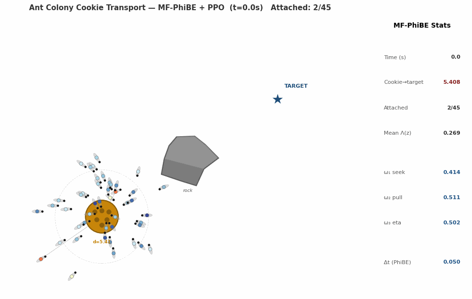

# 🐜 Ant Colony Cookie Transport — Mean-Field Control for Collective Intelligence

> *45 ants. One cookie. One target. No central coordinator.*  
> *Just stochastic dynamics, mean-field interactions, and reinforcement learning.*

---



This repository is a numerical experiment in **continuous-time Mean-Field Reinforcement Learning**.

The ants are not given explicit rules telling them how to surround the cookie, when to attach, or in which direction to pull. Instead, a common stochastic policy is learned from discrete-time observations of the population.

The learning algorithm follows the **Mean-Field PhiBE (MF-PhiBE)** framework introduced in

> **📄 [Mean-Field PhiBE: Continuous-Time Mean-Field Reinforcement Learning from Discrete-Time Data](https://arxiv.org/abs/2606.26498)**

MF-PhiBE is designed for continuous-time mean-field control problems in which the population is observed only at discrete times. In this repository, the population distribution is represented by interacting particles, the continuous-time drift and diffusion are estimated from observed state increments, and policy improvement is performed using **Proximal Policy Optimization (PPO)**.

The learner therefore does not receive the analytical dynamics during training: it only observes sampled transitions separated by a time interval $\Delta t$.

---

## Table of Contents

- [Why ants?](#why-ants)
- [Mean-field model](#mean-field-model)
  - [State and action](#state-and-action)
  - [Ant motion](#ant-motion)
  - [Attachment dynamics](#attachment-dynamics)
  - [Cookie dynamics](#cookie-dynamics)
  - [Noise](#noise)
  - [Reward](#reward)
- [Learning with MF-PhiBE + PPO](#learning-with-mf-phibe--ppo)
  - [Discrete observations](#discrete-observations)
  - [Law-based critic](#law-based-critic)
  - [Model-free drift and diffusion estimation](#model-free-drift-and-diffusion-estimation)
  - [Policy optimization with PPO](#policy-optimization-with-ppo)
- [Simulation parameters](#simulation-parameters)
- [Code structure](#code-structure)
- [References](#references)

---

## Why ants?

Collective transport in ant colonies is a striking example of decentralized coordination. Individual ants have no central controller and no globally assigned roles, yet a colony can collectively transport objects much larger than a single ant.

This type of behavior motivates models in which a large number of statistically similar agents interact through the **population distribution** rather than through a central coordinator.

Our question is:

> **Can a continuous-time mean-field control problem generate this type of collective behavior, and can the policy be learned using only discrete observations of the system?**

The experiment uses a **McKean–Vlasov control model**: each ant follows the same stochastic dynamics and policy, while the population interacts through its empirical distribution.

---

# Mean-field model

## State and action

Each ant has a five-dimensional state

$$
s=(x,z,y)\in\mathbb R^2\times\mathbb R\times\mathbb R^2.
$$

| Variable | Dimension | Meaning |
|---|---:|---|
| `x` | $\mathbb R^2$ | ant position |
| `z` | $\mathbb R$ | continuous attachment state |
| `y` | $\mathbb R^2$ | cookie center, shared by the population |

The effective attachment level is

$$
\Lambda(z)=\text{sigmoid}(z)\in(0,1).
$$

Thus, $\Lambda(z)\approx 0$ corresponds to a detached ant, while $\Lambda(z)\approx1$ corresponds to an ant strongly attached to the cookie.

Each ant chooses

$$
a=(u,\eta),
$$

where:

- $u\in\mathbb R^2$ is the locomotion control;
- $\eta\in(0,1)$ controls the attachment effort.

The $N$-particle population is represented through the empirical measure

$$
\mu_t^N=\frac1N\sum_{i=1}^N\delta_{s_t^i}.
$$

In the mean-field limit, this leads to a McKean–Vlasov controlled diffusion whose coefficients depend on the law $\mu_t$.

---

## Ant motion

The spatial dynamics combine six effects:

1. **learned locomotion** $u$;
2. **soft ant–ant repulsion**;
3. attraction toward the cookie when detached;
4. an elastic force keeping attached ants near the cookie;
5. a pulling bias toward the target;
6. repulsion from the rock.

In compact form,

$$
\begin{aligned}
b_x
={}&u
-\nabla(W_{\rm rep}*\rho)(x)\\
&+\beta_{\rm seek}(1-\Lambda(z))
\psi(\|x-y\|)
\frac{y-x}{\|y-x\|+\varepsilon}\\
&-\beta_{\rm hold}\Lambda(z)(x-y)
+\beta_{\rm pull}\Lambda(z)
\frac{B-y}{\|B-y\|+\varepsilon}
+F_{\rm rock}(x).
\end{aligned}
$$

Here $B$ is the target and

$$
\psi(d)=e^{-d^2/\ell^2}
$$

makes interactions with the cookie increasingly local as the ant moves away.

The obstacle is represented by a smooth Gaussian repulsive potential rather than a hard geometric constraint. This keeps the dynamics smooth while forcing the population to learn trajectories around the obstacle.

---

## Attachment dynamics

Attachment is represented by a continuous internal variable:

$$b_z=\kappa\left(c_{\rm sat}\,\eta\,\psi(\|x-y\|)-z\right).$$

An ant becomes strongly attached only when it is sufficiently close to the cookie and simultaneously applies attachment effort.

When it moves away from the cookie, attachment naturally decays.

---

## Cookie dynamics

The cookie is moved collectively by the population.

Its mean-field traction is

$$
\mathcal F(\mu) = F_0 \int \Lambda(z)\,\psi(\|x-y\|)\frac{x-y}{\|x-y\|+\varepsilon}\,\mu(dx,dz,dy).
$$

The cookie follows the overdamped dynamics

$$
b_y(\mu)=\frac{\mathcal F(\mu)+F_{\rm rock}(y)}{\gamma_c}.
$$

Therefore, no single ant controls the cookie directly. Its motion results from the **average contribution of the population**.

This is the principal mean-field coupling in the experiment.

---

## Noise

Only the ant position and attachment variable are stochastic:

$$
\sigma=ext{diag}\left(\sigma_x I_2,\,\sigma_z,\,0_{2\times2}\right).
$$

The cookie has no direct Brownian noise: once the population distribution is fixed, its instantaneous velocity is deterministic.

For visualization and simulation speed, the code uses a global time-rescaling factor. If $c>0$ denotes this factor, the simulated coefficients are

$$b\mapsto c\,b,\qquad\sigma\mapsto\sqrt c\,\sigma.$$

This corresponds to a change of time scale and preserves the relative structure of the dynamics.

---

## Reward

The running reward is

$$
r(s,\mu,a)=-\frac{c_y}{2}\|y-B\|^2-\frac{c_u}{2}\|u\|^2-\frac{c_\eta}{2}\eta^2-\frac{c_d}{2}\|x-y\|^2.
$$

It balances four objectives:

- move the cookie toward the target;
- avoid unnecessarily large locomotion controls;
- avoid unnecessary attachment effort;
- keep ants reasonably close to the cookie.

There is **no explicit reward for cooperation**.

Coordination appears indirectly because every ant is affected by the same cookie position and the cookie itself moves according to the mean-field traction generated by the population.

---

# Learning with MF-PhiBE + PPO

The learning stage is based on the MF-PhiBE framework of

> **📄 [Mean-Field PhiBE: Continuous-Time Mean-Field Reinforcement Learning from Discrete-Time Data](https://arxiv.org/abs/2606.26498)**.

The implementation uses a **law-based critic $V_\theta(\mu)$** and a particle approximation of the population distribution.

PPO is used as the policy-improvement step.

---

## Discrete observations

Although the underlying environment is continuous in time, the learning algorithm only observes transitions separated by

$$
\Delta t=0.05.
$$

The learner receives samples of the form

$$
(s_t,\mu_t,a_t,r_t,s_{t+\Delta t}).
$$

It does **not** receive the analytical drift $b$ or diffusion matrix $\Sigma$.

This is the central model-free aspect of the experiment.

---

## Law-based critic

In a mean-field control problem, the state of the system is described not only by one particle, but by the distribution of the whole population. MF-PhiBE therefore uses a critic that assigns a value to the current population distribution $\mu$:

$$
V_\theta(\mu).
$$

Here $V_\theta(\mu)$ approximates the expected discounted performance of the population when its current distribution is $\mu$. In the code, $\mu$ is represented through several population moments, including quantities describing:

- cookie–target distance;
- ant–cookie distance;
- average attachment;
- population traction;
- progress toward the target;
- interaction with the obstacle.

These observables are combined into a finite-dimensional cylindrical basis.

The required Lions derivatives of $V_\theta$ are computed **analytically** from this representation rather than using automatic finite differences.

---

## Model-free drift and diffusion estimation

For each observed transition, MF-PhiBE estimates the local drift directly from the increment:

$$
\widehat b=\frac{s_{t+\Delta t}-s_t}{\Delta t}.
$$

Similarly, the local diffusion covariance is estimated by

$$
\widehat\Sigma=\frac{(s_{t+\Delta t}-s_t)(s_{t+\Delta t}-s_t)^\top}{\Delta t}.
$$

These estimates are inserted into the infinitesimal MF-PhiBE advantage.

In the implementation, the equivalent contraction

$$
\widehat\Sigma:D_s\partial_\mu V_\theta
$$

is evaluated directly, avoiding the explicit construction of a full covariance matrix for every sample.

The critic is obtained from an empirical Galerkin system built from these discrete observations.

---

## Policy optimization with PPO

For a fitted critic $V_\theta$, the code evaluates the MF-PhiBE infinitesimal advantage

$$
\widehat q=r_\lambda+\widehat b\cdot\partial_\mu V_\theta(\mu)(s)+\frac12\widehat\Sigma:D_s\partial_\mu V_\theta(\mu)(s)-\beta V_\theta(\mu).
$$

The policy is then updated using the PPO clipped surrogate objective.

This gives the following actor–critic loop:

1. simulate the population under the current policy;
2. observe the system only every $\Delta t$;
3. estimate $\widehat b$ and $\widehat\Sigma$ from state increments;
4. fit the law-based critic $V_\theta(\mu)$;
5. compute the MF-PhiBE advantage;
6. improve the policy using PPO;
7. repeat.

The policy itself uses smooth transformations of Gaussian latent variables, so the action constraints are enforced without hard clipping and the likelihood ratio used by PPO remains consistent with the sampling distribution.

---

# Simulation parameters

The current experiment uses:

| Parameter | Value | Meaning |
|---|---:|---|
| $N$ | 45 | ants in the final simulation |
| $T$ | 10 | simulation horizon |
| $\Delta t$ | 0.05 | observation interval used by MF-PhiBE |
| $\ell$ | 1.2 | cookie interaction scale |
| $\beta_{\rm seek}$ | 3.0 | attraction of detached ants |
| $\beta_{\rm hold}$ | 2.5 | attachment spring |
| $\beta_{\rm pull}$ | 3.0 | target-oriented pulling bias |
| $F_0$ | 5.0 | mean-field traction strength |
| $\gamma_c$ | 3.0 | cookie drag |
| $W_0$ | 0.35 | ant repulsion strength |
| $\sigma_{\rm rep}$ | 0.8 | ant repulsion length scale |
| $\sigma_x$ | 0.22 | spatial noise |
| $\sigma_z$ | 0.04 | attachment noise |
| $c_y$ | 5.0 | cookie-target penalty |
| $\beta$ | 0.30 | continuous-time discount |
| time scale $c$ | 2.2 | global time rescaling |
| PPO iterations | 18 | actor–critic policy updates |

The displayed animation is generated independently after training using the final learned policy.

---

# Code structure

The main script

```text
ant_colony_mf_phibe_ppo_T10_dual_gif.py
```

contains four main components:

```text
Environment
├── McKean–Vlasov particle dynamics
├── ant repulsion
├── attachment dynamics
├── mean-field cookie traction
└── obstacle potential

MF-PhiBE critic
├── cylindrical features of μ
├── analytic Lions derivatives
├── discrete estimates of b and Σ
└── empirical Galerkin system

Actor
├── stochastic constrained policy
├── MF-PhiBE advantage
└── PPO policy optimization

Visualization
├── full diagnostic animation
├── simplified presentation animation
├── convergence plots
└── training diagnostics
```

Running the script produces two GIFs:

```text
ant_colony_mf_phibe_ppo_full_iter18_T10.gif
ant_colony_mf_phibe_ppo_simple_iter18_T10.gif
```

The first includes the full diagnostic panel. The second is a cleaner visualization intended for presentations, webpages, and compact displays.

---

# References

- Bayraktar, E., Hernandez, M., Yan, Q., & Zhu, Y. (2026). *Mean-Field PhiBE: Continuous-Time Mean-Field Reinforcement Learning from Discrete-Time Data*. [arXiv:2606.26498](https://arxiv.org/abs/2606.26498).

- Prabhakar, B., Dektar, K. N., & Gordon, D. M. (2012). The regulation of ant colony foraging activity without spatial information. *PLOS Computational Biology*, 8(8), e1002670.

- Zheng, T., Han, Q., & Lin, H. (2021). Transporting robotic swarms via mean-field feedback control. *IEEE Transactions on Automatic Control*, 67(8), 4168–4175.

- Carmona, R., & Delarue, F. (2018). *Probabilistic Theory of Mean Field Games with Applications*. Springer.

---
